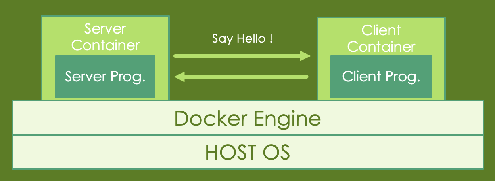

# Docker

### In this task, you are required to create two Docker containers. One container runs the server, and the other container runs the client, allowing the client to communicate with the server and transmit messages.

### Once you have installed Docker and downloaded the required files, you can proceed with the following steps.

### Note: In this section, you are required to take screenshots of the command output to include in your report when you see something like this:

    <strong>Note:</strong> This is an example of what you would see when you are required to take screenshot and include in your report. <strong>(0 points)</strong>

