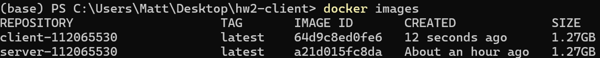
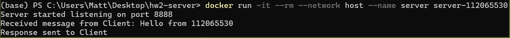
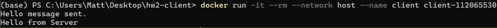

# Task 1: Building the images

### 1. Enter the client folder, open and modify the `PLEASE ASSIGN` section and append your student ID in `socket_client.c` as shown in the following image:


### 2. Build the image with the Dockerfile
- If you're on arm64 architecture (e.g., Apple M1/M2), you'll have to modify the Dockerfile to use `socket_server_arm` instead.
```bash
cd path/to/server
docker build -t server-<your_student_id>
cd path/to/client
docker build -t client-<your_student_id>
```
You can use the following command to check images you've built:
```bash
docker images
```

<div class="warning">
You need to submit the screenshot of the list of your images. <strong>(5 points)</strong>
</div>




### 3. Launch the server container first, and then launch the client container:
```bash
docker run -it --rm --network host \
    --name server \
    server-<your_student_id>
docker run -it --rm --network host \
    --name client \
    client-<your_student_id>
```
The command `docker run` will create the container instance with the image and execute the container.

<div class="warning">
You need to submit the screenshot of the output of the server and client containers. <strong>(5 points)</strong>
</div>



