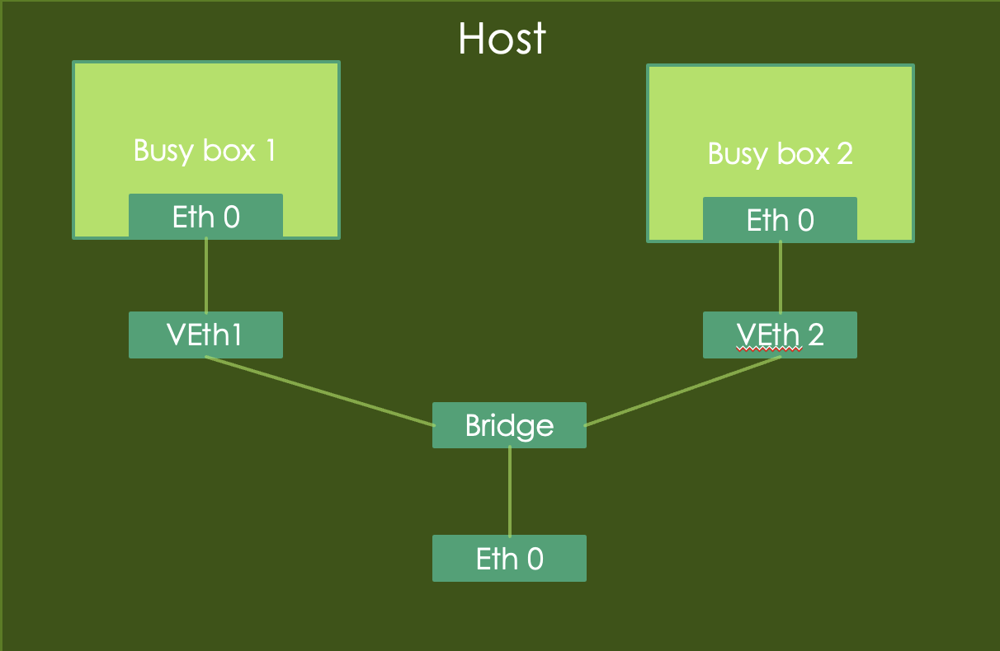
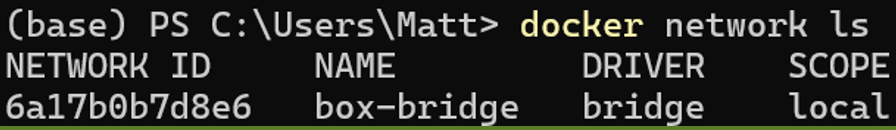
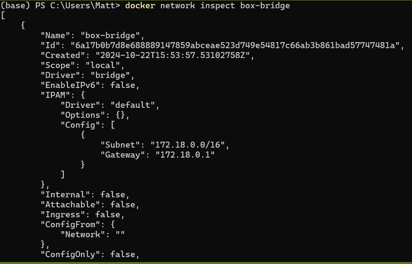

# Task 2: Creating bridge

### In this task, you are required to create a bridge to connect two container. (***not related to Task 1***)


### 1. Create 2 containers using the following commands:
```bash
docker container run -d --rm --name box1 busybox /bin/sh -c "while true; do sleep 3600; done“
```
```bash
docker container run -d --rm --name box2 busybox /bin/sh -c "while true; do sleep 3600; done"
```

### 2. Create a network bridge:
```bash
docker network create box-bridge
```

### 3. Connecting two running containers to the network bridge:
```bash
docker network connect box-bridge box1
docker network connect box-bridge box2
```

### 4. You can use the following command to list docker networks:
```bash
docker network ls
```
<div class="warning">
    <strong>Note:</strong> You need to include the screenshot of the command output above in your report. <strong>(5 points)</strong>
</div>



### 5. You can inspect more about the details of the `box-bridge` network:
```bash
docker network inspect box-bridge
```
<div class="warning">
    <strong>Note:</strong> You need to include the screenshot of the command output above in your report. Points WILL BE DEDUCTED if any output text get cropped out. <strong>(5 points)</strong>
</div>



### 6. Log into `box1` and try to ping `box2`:
```bash
docker exec -it box1 sh
ping box2
```
<div class="warning">
    <strong>Note:</strong> You need to include the screenshot of the command output above in your report. <strong>(5 points)</strong>
</div>
