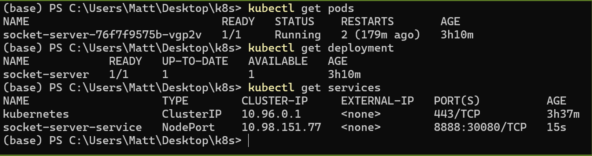
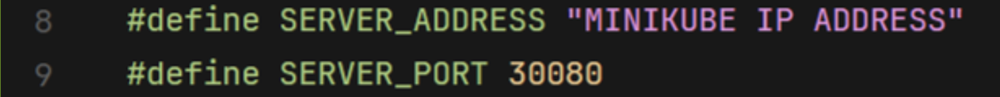

# Task 1: Launching K8s and deploy our containers

## Launch your Kubernetes cluster
### 1. Start the Kubernetes cluster
```bash
minikube start
```

### 2. Get the instructions to point your docker client to point to the minikube docker daemon
```bash
minikube docker-env
```

### 3. Check the status of your minikube deployment
```bash
minikube status
```


## Deploy the containers into the cluster
### 1. Enter the k8s folder, modify the files as required and input the following command:
```bash
kubectl apply -f deployment.yaml
kubectl apply -f service.yaml
```

### 2. Check the status of your deployment
```bash
kubectl get pods
kubectl get deployment
kubectl get services
```
<div class="warning">
    <strong>Note:</strong> You need to include the screenshot of the command output above in your report. <strong>(10 points)</strong>
</div>



### 3. Answer the following questions and include the answers in your report:
- What is Kubernetes? Why do we need it? ***(5 points)***
- Please explain the concepts of `Deployment`, `Service` and `Pod`. ***(5 points)***
- Why k8s use pod to manipulate the application instead of the container. ***(5 points)***
- What is `Replica Set` in Kubernetes? ***(5 points)***
- Why can the client successfully communicate through port 30080 when the server is listening on port 8888? ***(10 points)***

## (Optional) Check if your container is running correctly on the minikube
### 1. Get the ip address of the minikube:
```bash
minikube ip
```

### 2. Open and modify the `PLEASE ASSIGN` section in `docker/client/socket_client.c`. (Replace `<MINIKUBE_IP>` with your actual minikube ip):


### 3. Build and run the client container.

## Tear down the deployed services and minikube cluster after you finished testing:
```bash
kubectl delete -f service.yaml
kubectl delete -f deployment.yaml
minikube stop
```
