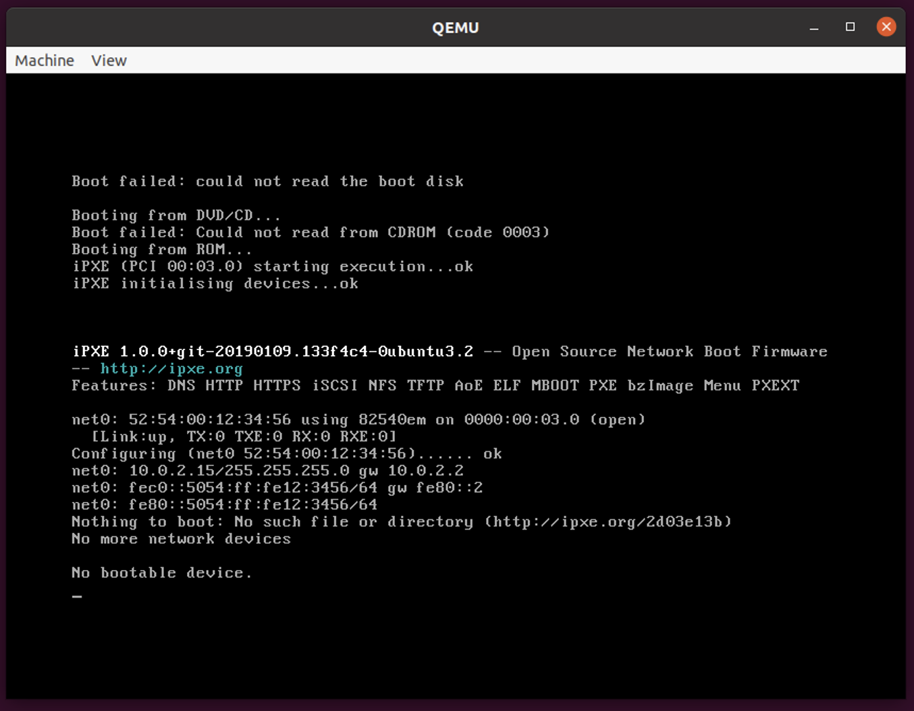

# Task 1: Setting up guest1

## 1. Enter the following command into the terminal:
```bash
sudo apt update -y
sudo apt install vim qemu-kvm nfs-kernel-server net-tools
```

## 2. Before launching QEMU on the first guest VM, obtain the IP address of this VM.
```bash
ip a
```
For example:


## 3. Create a QEMU image file:
```bash
qemu-img create -f qcow2 ubuntu.qcow2 10G
```

## 4. Create a new directory in `/mnt` and modify its ownership and permissions:
```bash
sudo mkdir -p /mnt/nfs
sudo chown nobody:nogrouup /mnt/nfs
sudo chmod 777 /mnt/nfs
```

## 5. Move the QEMU image file you just created into the new directory:
```bash
mv ubuntu.qcow2 /mnt/nfs
```

## 6. Edit the file at `/etc/exports` with superuser privileges:
```bash
sudo vim /etc/exports
```

## 7. Add the following line to the end of the exports file and save it:
```bash
/mnt/nfs *(rw,sync,no_subtree_check,no_root_squash)
```

## 8. Return to the terminal and enter this command to update the exports file:
```bash
sudo exportfs -arv
```

## 9. Launch QEMU to simulate a running process on the virtual machine:
```bash
sudo qemu-system-x86_64 \
    -cpu host -enable-kvm -m 2G -smp 1 \
    -drive if=virtio,format=qcow2,file=/mnt/nfs/ubuntu.qcow2 \
    -monitor telnet:127.0.0.1:5500,server,nowait
```

## 10. A window similar to this will then appear:

