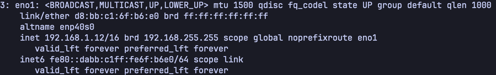
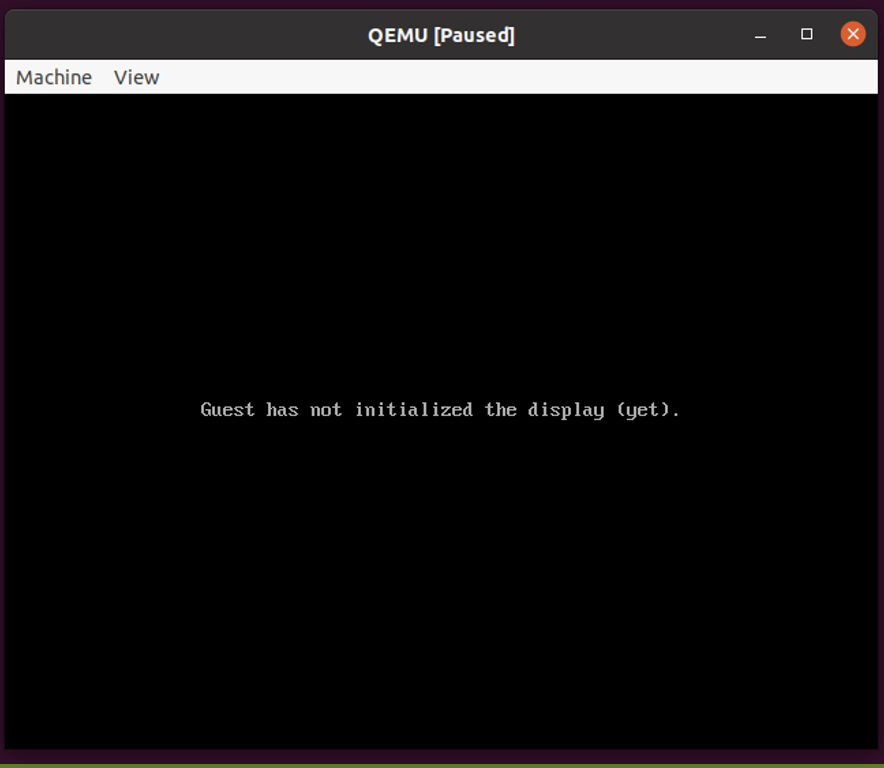

# Task 2: Setting up guest2

### 1. Enter the following commands into the terminal:
```bash
sudo apt update -y
sudo apt install -y qemu-kvm net-tools nfs-common
```

### 2. Before launching QEMU on the second guest VM, obtain the IP address of this VM.
```bash
ip a
```


### 3. Enter the following commands into the terminal to mount NFS service:
```bash
sudo mkdir -p /mnt/nfs
sudo mount -t nfs <replace_with_guest1_ip>:/mnt/nfs /mnt/nfs>
```

### 4. Luanch QEMU on the second VM to prepare for the incoming live virtual machine migration:
```bash
sudo qemu-system-x86_64 \
    -cpu host -enable-kvm -m 2G -smp 1 \
    -drive if=virtio,format=qcow2,file=/mnt/nfs/ubuntu.qcow2 \
    -incoming tcp:0:4400
```
A window similar to this will then appear:

