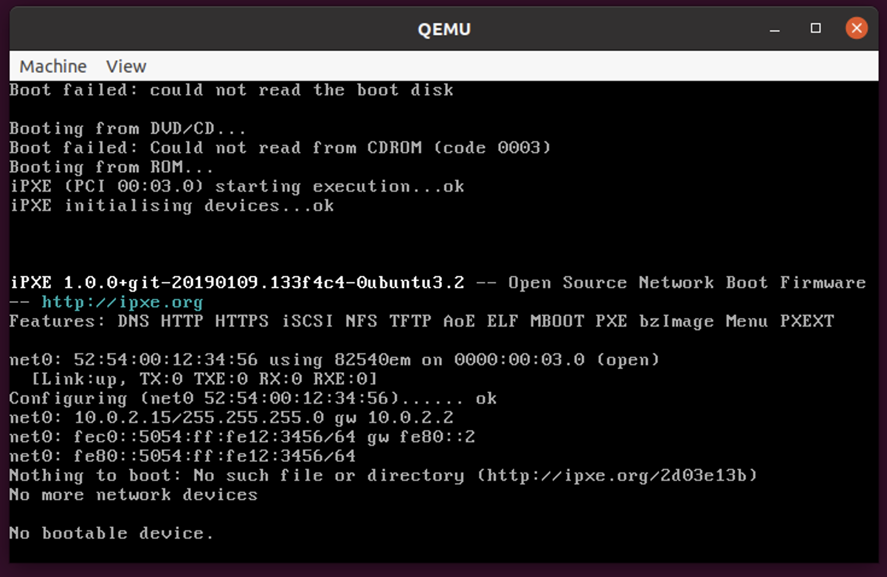

# Task 3: Migrate from guest1 to guest2

### 1. Return the first guest VM, open a new terminal tab, and enter the following command:
```bash
telnet 127.0.0.1 5500
```

### 2. Upon the new command prompt, issue the following command to initiate the live migration process:
```bash
migrate -d tcp:<replace_with_guest2_ip>:4400
```

### 3. Show the migration info:
```bash
info migrate
```

### 4. The screen of the QEMU window on `guest2` should now appear as follows:


This indicates that you've successfully completed the live migration of the virtual machine.

