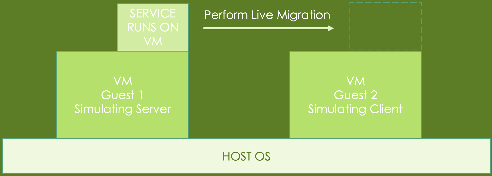

# Exploring Virtual Machine Live Migration: Performance Analysis and Optimization

## Live Migration
Live Migration is a crucial feature in virtualization technology that allows the transfer of a running virtual machine (VM) from one physical host to another without interrupting the VM's operation or services.

## The architecture we want to simulate:

## Our Homework Architecture:
Since not everyone will have 2 PCs available to run QEMU on them, we provided an alternative option:   

- Note: VirtualBox now has native Apple Silicon support on Apple hardware with M-Series chips, but we haven't yet tested the nested virtualization feature, so this homework may not work out on your hardware by default.
- If you still want to test that out, feel free to ask us through the discussion/email on eeclass.
- Or you can use the PC room in C.L.Liu(EECS) 3F, we already have VirtualBox installed in there.
