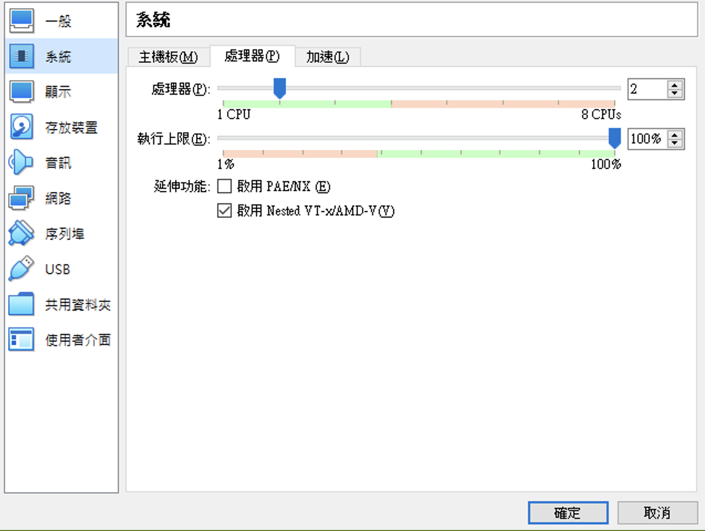

# VirtualBox

Using VirtualBox is similar to using VMWare Workstation, but you need to enable nested virtualization.

## Use GUI to enable Nested Virtualization


## Use Command Line to Enable Nested Virtualization
1. Go to the directory of the VirtualBox you installed.
2. Open Command Prompt right in the place.
3. Enter the command below to enable nested virtualization:
   ```bash
   .\VBoxManage.exe modifyvm "VM Name" --nested-hw-virt on
   ```
   Replace `"VM Name"` with the name of your virtual machine.
