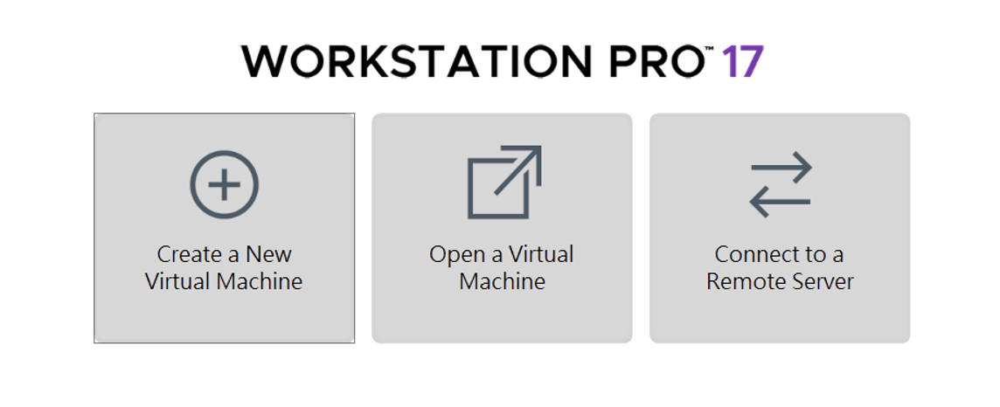
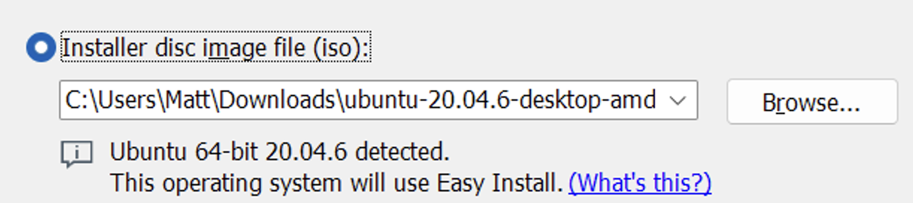
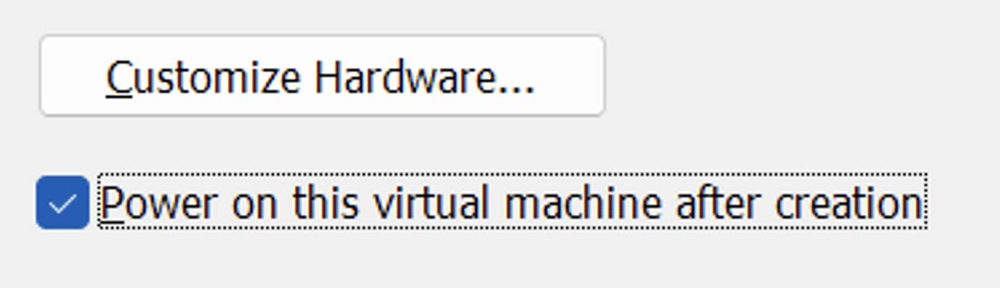
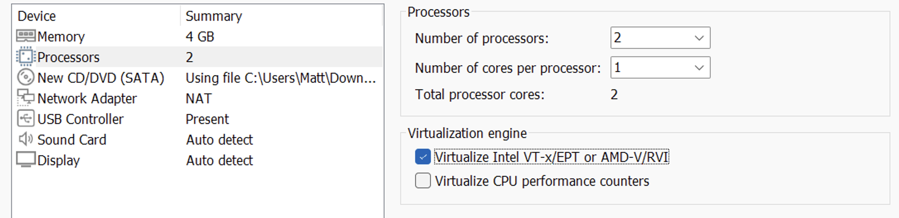

# VMWare Workstation

### 1. Assuming you've downloaded the VMWare Workstation installer and Ubuntu image file.
### 2. Install the VMWare Workstation.
### 3. Click "Create a New Virtual Machine" and proceed with the creation process.  

### 4. Use the Ubuntu image you've already downloaded. (Use the version you downloaded, not 20.04 in the image)  

### 5. Click "Customize Hardware..."

### 6. Go to "Processors" tab and enable "Virtualize Intel VT-x/EPT or AMD-V/RVI".

### 7. Repeat the above steps to create a second virtual machine.  

### 8. Boot each virtual machine and complete the Ubuntu installation process.

### 9. After completing the installation process, open the terminal from your Applications menu.
